<p align="center">
  
</p>

<p align="center">
  I build <strong>intelligent systems for cities, mobility, health, and everyday decisions</strong>—from data pipelines and ML models to APIs, mobile apps, and polished interfaces.
</p>

<p align="center">
  <a href="https://aditya-portfolio-ivory-nine.vercel.app/"></a>
  <a href="https://www.linkedin.com/in/sharmaditya01"></a>
  <a href="mailto:sharma.aditya2k05@gmail.com"></a>
</p>

<p align="center">
  
  <a href="https://github.com/Sharmaditya2k05?tab=repositories"></a>
</p>

---

## The developer behind the projects

```python
aditya = {
    "focus": ["Applied AI/ML", "Intelligent Systems", "Full-Stack Development"],
    "domains": ["Smart Cities", "Mobility", "Computer Vision", "Health Tech"],
    "approach": "Build the whole system, not just the model",
    "currently_exploring": ["Advanced AI", "System Design", "Scalable Products"],
}
```

- 🧠 I turn ideas into end-to-end systems spanning data, models, backends, mobile or web interfaces, and deployment.
- 🌆 I’m especially interested in AI for urban intelligence, transportation, sustainability, and decision support.
- 📱 I enjoy combining machine learning with Android and full-stack development to create products people can actually use.
- 🤝 I’m open to collaborating on ambitious AI/ML, computer-vision, app-development, and smart-city projects.
- 💬 Ask me about Python, C++, Android development, machine learning, OpenCV, or application architecture.

---

## Featured systems

<table>
  <tr>
    <td width="50%" valign="top">
      <h3><a href="https://github.com/Sharmaditya2k05/UrbanMind">🌆 UrbanMind AI</a></h3>
      <p>A research-grade smart-city digital twin combining simulation, GIS, forecasting, urban analytics, and an AI policy engine to model how a modern city evolves.</p>
      <p><strong>AI/ML · Data Engineering · FastAPI · React · GIS</strong></p>
    </td>
    <td width="50%" valign="top">
      <h3><a href="https://github.com/Sharmaditya2k05/NutriLensAI">🥗 NutriLens AI</a></h3>
      <p>A food-intelligence platform with barcode lookup, ingredient red-flag detection, Nutri-Score and NOVA grading, RAG-powered Gemini explanations, and diet planning.</p>
      <p><strong>React · FastAPI · RAG · Gemini · Machine Learning</strong></p>
    </td>
  </tr>
  <tr>
    <td width="50%" valign="top">
      <h3><a href="https://github.com/Sharmaditya2k05/DrDrive">🚗 DrDrive</a></h3>
      <p>An AI-powered Android car-inspection system combining OBD-II telemetry and computer vision to assess damage, predict failures, estimate costs, and evaluate resale value.</p>
      <p><strong>Android · Java · FastAPI · YOLOv8 · OpenCV</strong></p>
    </td>
    <td width="50%" valign="top">
      <h3><a href="https://github.com/Sharmaditya2k05/Traffic-Signal-Analyser-and-simulator">🚦 Traffic Signal Analyzer</a></h3>
      <p>An interactive traffic simulation comparing fixed-time, greedy, and priority-queue scheduling through waiting-time metrics, complexity analysis, and 3D visualization.</p>
      <p><strong>C++17 · Python · Streamlit · Plotly · Algorithms</strong></p>
    </td>
  </tr>
  <tr>
    <td width="50%" valign="top">
      <h3><a href="https://github.com/Sharmaditya2k05/Aditya_Portfolio">🪄 Interactive Portfolio</a></h3>
      <p>A cinematic full-stack portfolio with scroll-driven visuals, modular content architecture, optimized media, contact workflows, and persistent project data.</p>
      <p><strong>Next.js · TypeScript · Tailwind · Prisma · PostgreSQL</strong></p>
    </td>
    <td width="50%" valign="top">
      <h3><a href="https://github.com/Sharmaditya2k05/trendpulse-Aditya-Sharma">📡 TrendPulse</a></h3>
      <p>A live-data pipeline that collects trending information through APIs, cleans and analyzes it, and turns the results into clear visual narratives.</p>
      <p><strong>Python · APIs · Pandas · EDA · Data Visualization</strong></p>
    </td>
  </tr>
</table>

<p align="center"><a href="https://github.com/Sharmaditya2k05?tab=repositories"></a></p>

---

## Engineering toolkit

<p><strong>Languages</strong></p>
<p>
  
  
  
  
  
  
  
</p>

<p><strong>AI, machine learning & data</strong></p>
<p>
  
  
  
  
  
  
  
</p>

<p><strong>Applications, APIs & data stores</strong></p>
<p>
  
  
  
  
  
  
  
  
</p>

<p><strong>Build, design & deployment</strong></p>
<p>
  
  
  
  
  
  
  
</p>

---

## Current direction

```text
01  Build deeper AI systems, not isolated demos
02  Connect ML models to reliable APIs and real interfaces
03  Explore intelligent cities, mobility, sustainability, and health
04  Strengthen system design, deployment, and product engineering
```

---

## Contribution activity

<p align="center"><a href="https://github.com/Sharmaditya2k05"></a></p>

---

## Build with me

Have an idea involving **applied AI, computer vision, intelligent mobility, smart-city systems, Android, or full-stack products**? Let’s turn it into something real.

<p align="center">
  <a href="mailto:sharma.aditya2k05@gmail.com"><strong>Email</strong></a>&nbsp; • &nbsp;
  <a href="https://www.linkedin.com/in/sharmaditya01"><strong>LinkedIn</strong></a>&nbsp; • &nbsp;
  <a href="https://aditya-portfolio-ivory-nine.vercel.app/"><strong>Portfolio</strong></a>&nbsp; • &nbsp;
  <a href="https://www.instagram.com/Sharmaditya_01"><strong>Instagram</strong></a>
</p>

<p align="center"></p>
